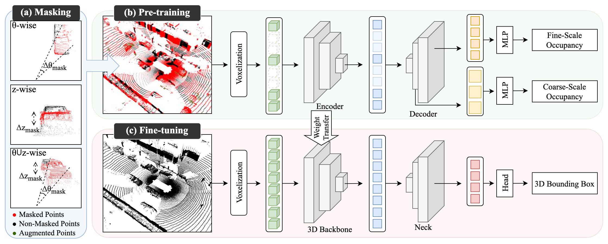
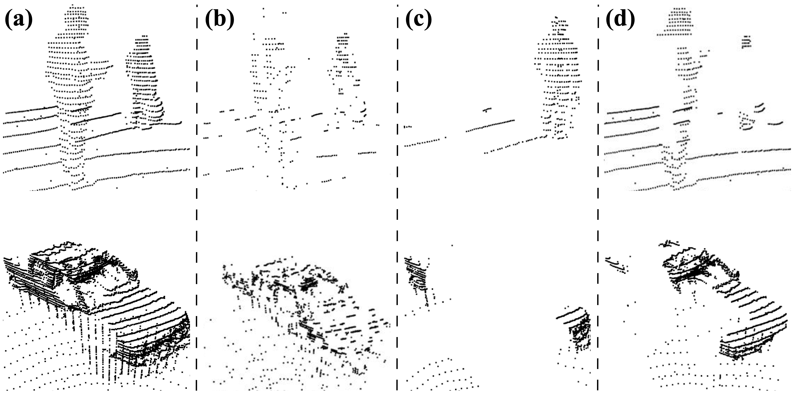
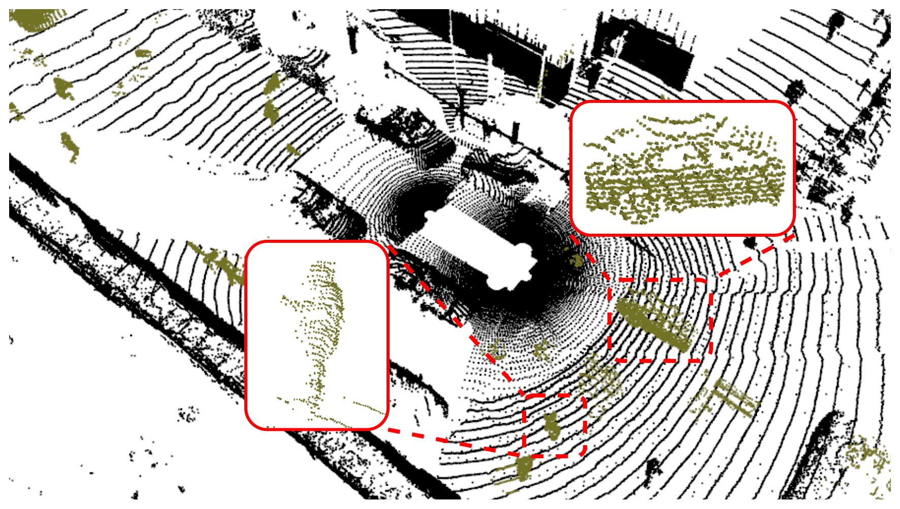
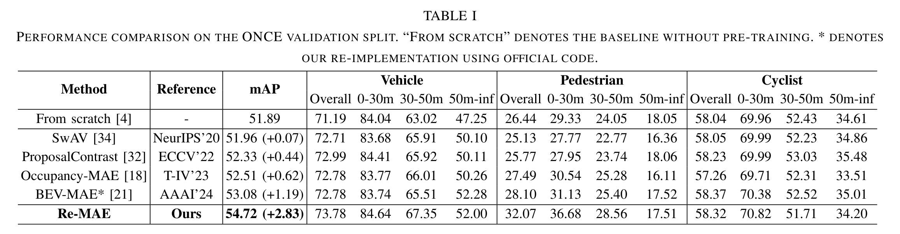
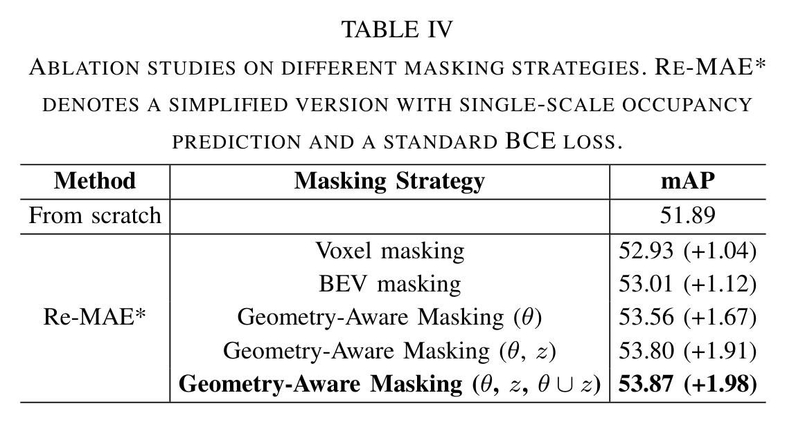
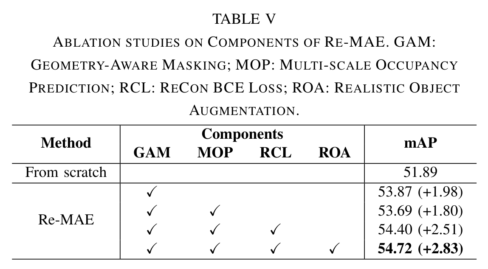
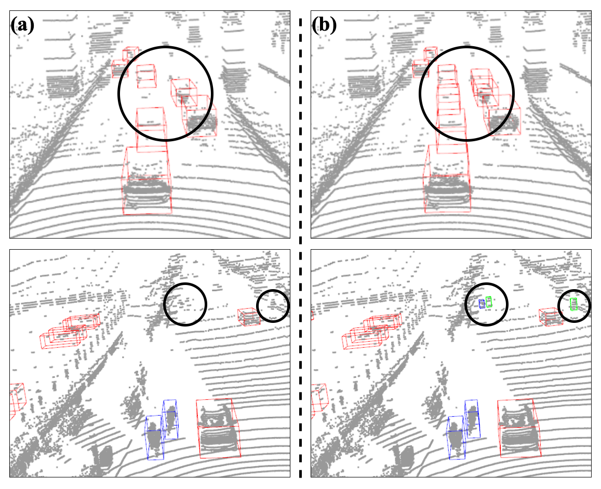

<div align="center">

<h1>Re-MAE</h1>
<h3>Rethinking Masked Autoencoders towards Geometry-Aware<br>Self-Supervised LiDAR-based 3D Object Detection</h3>

<p><strong>Accepted to IEEE ICRA 2026</strong></p>

<p>
Youngho Cheon &nbsp;·&nbsp; Jae-Keun Lee &nbsp;·&nbsp; Soon Kwon &nbsp;·&nbsp; Jin-Hee Lee<sup>*</sup> &nbsp;·&nbsp; Yongseob Lim<sup>*</sup>
</p>

<p>
Daegu Gyeongbuk Institute of Science &amp; Technology (DGIST)<br>
<sub>* Corresponding authors</sub>
</p>


<p>
<a href="#overview">Overview</a> &nbsp;·&nbsp;
<a href="#results">Results</a> &nbsp;·&nbsp;
<a href="#qualitative-comparisons">Qualitative Comparisons</a> &nbsp;·&nbsp;
<a href="#citation">Citation</a>
</p>

</div>

> [!NOTE]
> **The code and model weights are being prepared for release.** They will be made available in this repository once ready.

**Re-MAE** is a geometry-aware self-supervised pre-training framework for **LiDAR-based 3D object detection**. It rethinks **“what to learn”** and **“how to learn”** by explicitly considering occlusion, distance-driven sparsity, and occupied–empty voxel structure.

## Overview

<p align="center">
  <a href="assets/figures/fig3_framework.png"></a>
</p>
<p align="center"><sub><strong>Figure 3.</strong> Re-MAE pre-trains an encoder through multi-scale occupancy reconstruction and transfers its weights to the backbone of a downstream 3D object detector.</sub></p>

Re-MAE combines three components:

- **Geometry-Aware Masking** simulates spatially contiguous occlusions using azimuthal, vertical, and combined masking. Its distance-aware masking ratio preserves reconstruction cues in sparse, far-range regions.
- **Reconstruction-Contextual BCE (ReCon BCE) loss** guides fine- and coarse-scale occupancy prediction through distance, boundary, and masking weights, accounting for LiDAR sparsity and occupied–empty voxel imbalance.
- **Realistic Object Augmentation** increases foreground diversity without manual labels by placing potential object point clusters in object-free road regions while accounting for distance-dependent point density.

**Pre-training uses no ground-truth annotations.** The pre-trained encoder initializes the detector backbone; downstream fine-tuning uses labeled data.

<details>
<summary><strong>View masking and augmentation examples</strong></summary>

### Geometry-Aware Masking

<p align="center">
  <a href="assets/figures/fig2_masking_strategies.png"></a>
</p>
<p align="center"><sub><strong>Figure 2.</strong> Original point cloud, voxel masking, BEV masking, and the proposed Geometry-Aware Masking.</sub></p>

### Realistic Object Augmentation

<p align="center">
  <a href="assets/figures/fig4_object_augmentation.png"></a>
</p>
<p align="center"><sub><strong>Figure 4.</strong> Original points are shown in black; augmented object points are shown in green.</sub></p>

</details>

## Results

### ONCE validation

Using **SECOND**, Re-MAE is pre-trained on the **100k-scene unlabeled small split** and fine-tuned on the **5k-scene labeled training split**. Results are evaluated on the **ONCE validation split**.

| Method | mAP ↑ | Vehicle AP ↑ | Pedestrian AP ↑ | Cyclist AP ↑ |
| :--- | ---: | ---: | ---: | ---: |
| From scratch | 51.89 | 71.19 | 26.44 | 58.04 |
| **Re-MAE** | **54.72** | **73.78** | **32.07** | **58.32** |

Re-MAE improves over the from-scratch baseline by **+2.83 mAP**, with a **+5.63 AP** gain for pedestrians. Gains are absolute metric-point improvements.

<p align="center">
  <a href="assets/tables/table1_once.png"></a>
</p>

<details>
<summary><strong>View ONCE ablation studies (Tables IV and V)</strong></summary>

**Masking strategies.** In the simplified setting with single-scale occupancy prediction and standard BCE, Geometry-Aware Masking achieves **53.87 mAP**, compared with **52.93** for voxel masking and **53.01** for BEV masking.

<p align="center">
  <a href="assets/tables/table4_masking_ablation.png"></a>
</p>

**Component analysis.** Adding multi-scale occupancy prediction alone changes mAP from **53.87 to 53.69**. ReCon BCE then raises it to **54.40**, and Realistic Object Augmentation brings the full model to **54.72**.

<p align="center">
  <a href="assets/tables/table5_component_ablation.png"></a>
</p>

</details>

## Qualitative Comparisons

### ONCE validation

<p align="center">
  <a href="assets/figures/fig1_once_qualitative.png"></a>
</p>
<p align="center"><sub><strong>Figure 1.</strong> SECOND initialized with (a) Occupancy-MAE and (b) Re-MAE. Bounding boxes denote vehicles (red), pedestrians (green), and cyclists (blue).</sub></p>

## Release Status

| Resource | Status |
| :--- | :--- |
| Method overview and results | Available on this page |
| Paper link | To be added when available |
| Code | In preparation |
| Model weights | In preparation |

The code and model weights will be made available here once they are ready for public release.

## Citation

Please cite the accepted conference paper below. Publication details will be updated when available.

```bibtex
@inproceedings{cheon2026remae,
  title     = {{Re-MAE}: Rethinking Masked Autoencoders towards
               Geometry-Aware Self-Supervised {LiDAR}-based
               {3D} Object Detection},
  author    = {Cheon, Youngho and Lee, Jae-Keun and Kwon, Soon
               and Lee, Jin-Hee and Lim, Yongseob},
  booktitle = {2026 IEEE International Conference on Robotics and Automation (ICRA)},
  year      = {2026},
  note      = {Accepted to ICRA 2026}
}
```

## Contact

For questions about this work, please contact [Youngho Cheon](mailto:yhcheon@dgist.ac.kr).
